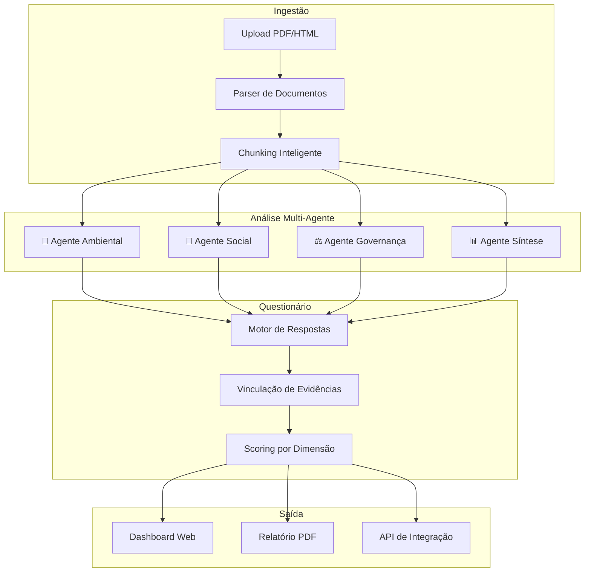

# 🔍 Análise de Viabilidade: SwarmInt Brasil → Plataforma de Avaliação ESG

## O que você tem hoje (SwarmInt Brasil)

| Módulo | O que faz | Arquivo |
|--------|-----------|---------|
| **Crawler** | Scraping de 11 fontes RSS brasileiras (G1, Folha, InfoMoney, etc.) | `crawler.py` |
| **NER** | Extração de entidades, sentimento, classificação e geo-enriquecimento via GPT-4o-mini | `ner.py` |
| **4 Agentes** | Analista Político, Economista, Jornalista Social, Criador de Cenários — rodam em paralelo com ThreadPoolExecutor | `agents.py` |
| **Grafo** | Constrói grafo de conhecimento com nós/arestas a partir das entidades | `graph.py` |
| **Pipeline** | Orquestra crawl → NER → grafo → agentes → broadcast WebSocket | `main.py` |
| **Persistência** | SQLite com artigos, briefings e snapshots do grafo | `db.py` |
| **Frontend** | Vue.js + globe.gl (visualização 3D geopolítica) | `frontend/` |

## O que você precisa (Plataforma ESG)

| Necessidade | Descrição |
|-------------|-----------|
| **Ingestão de Documentos** | Upload de relatórios corporativos (PDFs, HTML, comunicados de RI) — NÃO crawling de RSS |
| **Análise Temática** | Extrair trechos relevantes por tema ESG (meio ambiente, governança, social, etc.) |
| **Questionário Estruturado** | Perguntas pré-definidas com respostas fundamentadas por trechos dos documentos |
| **Agentes Especializados** | Cada agente analisa um pilar/dimensão ESG (não mais política/economia geral) |
| **Rastreabilidade** | Vincular cada resposta ao trecho exato do relatório que a fundamenta |
| **Scoring** | Gerar uma nota/avaliação por tema, com peso configurável |
| **Frontend** | Dashboard com questionário, visualização de respostas e evidências — NÃO um globo 3D |

---

## Comparação Direta: O que Reaproveita vs O que Muda

### ✅ O que dá para reaproveitar (parcialmente)

| Componente | Reaproveitamento | Observação |
|------------|-----------------|------------|
| `agents.py` — Arquitetura multi-agente paralela | **~40%** | A estrutura `AGENT_DEFINITIONS` + `ThreadPoolExecutor` + `run_all_agents()` é excelente. Mas os **prompts, domínios e output schema** mudam completamente (de briefings geopolíticos para respostas de questionário ESG) |
| `agents.py` — Query livre (`run_swarm_query`) | **~30%** | A mecânica de "perguntar aos agentes" é útil, mas o contexto agora vem de documentos corporativos, não de notícias |
| `main.py` — Pipeline de orquestração | **~20%** | A estrutura Flask + SocketIO + background tasks é boa, mas todo o fluxo muda: de crawl→NER→grafo → para upload→parsing→análise→questionário |
| `db.py` — Padrão de persistência | **~15%** | O pattern com SQLite é ok para MVP, mas o schema é 100% diferente (empresas, documentos, questionários, respostas, evidências) |
| `ner.py` — Extração de entidades | **~10%** | A estrutura de chamar GPT com prompt de extração é similar, mas o prompt muda totalmente (de NER geopolítico para extração temática ESG) |

### ❌ O que NÃO serve

| Componente | Motivo |
|------------|--------|
| `crawler.py` | Você não vai raspar RSS. Vai receber documentos por upload |
| `graph.py` | Não precisa de grafo de co-ocorrência geográfica |
| `ner.py` — GEO_LOOKUP (80% do arquivo) | Todo o mapa de cidades/estados é irrelevante |
| `ner.py` — `classify_event_type` | Classificação politics/economy/social não se aplica |
| Frontend Vue.js + globe.gl | Completamente diferente — precisa de dashboard com questionário |

---

## ⚖️ Veredicto: Iniciar Projeto Novo

### Por que NÃO reaproveitar o SwarmInt como base:

1. **~80% do código precisa ser reescrito** — crawler, NER, grafo, frontend, schema do banco
2. **O que "se aproveita" é padrão, não código** — ThreadPoolExecutor com OpenAI é um pattern de 30 linhas que se reescreve em minutos
3. **Dívida técnica desnecessária** — carregar dependências do SwarmInt (eventlet, beautifulsoup, globe.gl) que não fazem sentido pro novo projeto
4. **Confusão conceitual** — misturar código de inteligência geopolítica com avaliação ESG corporativa dificulta manutenção
5. **Git history poluído** — o histórico de commits não vai fazer sentido para o produto novo

### O que vale levar embora (copiar como referência):

```
✅ O PATTERN dos agentes paralelos (agents.py linhas 219-248)
✅ O PATTERN de chamar GPT com response_format JSON (agents.py linhas 164-175)
✅ O PATTERN de WebSocket broadcast (main.py linhas 88-104)
✅ A ESTRUTURA de Flask + SocketIO + background tasks
```

> [!TIP]
> Esses patterns são **~60 linhas no total**. Copiar e adaptar é muito mais rápido do que refatorar 1200+ linhas do SwarmInt.

---

## 🏗️ Arquitetura Proposta: Plataforma ESG



### Stack Sugerida

| Camada | Tecnologia | Justificativa |
|--------|-----------|---------------|
| Backend | **Python + FastAPI** | Mais moderno que Flask, async nativo, melhor para processamento de documentos |
| LLM | **OpenAI GPT-4o** | Já tem a key, mantém consistência |
| Parsing PDF | **PyMuPDF / pdfplumber** | Extração de texto de relatórios corporativos |
| Banco | **Supabase (PostgreSQL)** | Já tem experiência, melhor que SQLite para produção |
| Frontend | **React + Vite** ou **Vue 3** | Dashboard com formulários, tabelas e visualizações |
| Busca semântica | **Embeddings + pgvector** | Para encontrar trechos relevantes nos documentos |

### Fluxo de Dados

```
1. Analista faz upload do relatório da empresa (PDF/HTML)
2. Sistema extrai texto, divide em chunks temáticos
3. Embeddings são gerados e armazenados (para busca semântica)
4. Questionário é carregado (perguntas por dimensão ESG)
5. Para cada pergunta:
   a. Busca semântica encontra trechos relevantes
   b. Agente especializado analisa os trechos
   c. Gera resposta fundamentada + score
   d. Vincula evidência ao trecho original
6. Dashboard apresenta respostas com evidências clicáveis
7. Analista humano valida/ajusta e aprova
```

---

## 📋 Próximos Passos

Antes de começar a codar, preciso que você me responda:

1. **Questionário**: Você já tem as perguntas definidas? Quantas são, aproximadamente? São organizadas por temas/dimensões?
2. **Documentos de entrada**: São PDF corporativos publicados via RI (Relação com Investidores)? HTML? Arquivo de texto?
3. **Users**: Quem usa — um analista fazendo avaliação, ou vários analistas em equipe?
4. **Escala**: Quantas empresas são avaliadas por mês, aproximadamente?
5. **Output esperado**: O resultado final é um relatório, um score numérico, ambos?
6. **Stack preference**: Quer manter Python + Vue (como no SwarmInt) ou está aberto a outra stack?
